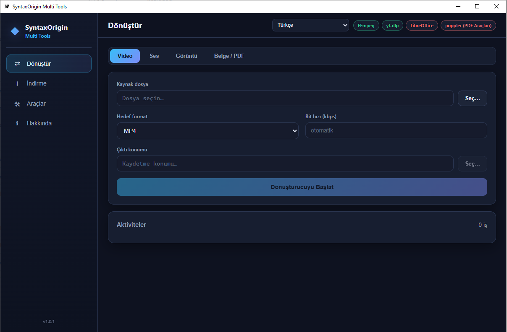

# SyntaxOrigin Multi Tools

A desktop **multi-format file converter + media downloader** built with
[Wails](https://wails.io) v2. It runs as a real native application on
**Windows** and **Linux** (no browser needed) and ships with an interface
translated into **21 languages**.

Convert video, audio, image and office/PDF documents between formats, or paste
a link from thousands of platforms (YouTube, TikTok, Instagram, ...) and
download it as video or MP3 audio. FFmpeg and yt-dlp are installed with a
single click right on the Tools tab — no manual setup required.

---

## Screenshot



---

## Features

- **Convert** video, audio, image and document files between formats.
- **Download** video / MP3 from thousands of platforms via [yt-dlp](https://github.com/yt-dlp/yt-dlp).
- **One-click tool installation** — FFmpeg, yt-dlp, with automatic detection of
  LibreOffice / poppler (used for PDF work).
- **21 languages**, chosen automatically from your system, from the language
  selector in the top bar, or remembered from your previous choice.
- **Live job list** with progress bars and per-step status messages.
- **Dark, keyboard-friendly desktop UI** (vanilla JS, no external frontend
  libraries).

## Supported conversions

| Kind     | Inputs                                          | Outputs                        |
|----------|-------------------------------------------------|--------------------------------|
| Video    | mp4, mkv, avi, mov, webm                        | mp4, mkv, avi, mov, webm       |
| Audio    | mp3, wav, flac, aac, ogg                        | mp3, wav, flac, aac, ogg       |
| Image    | png, jpg (jpeg), webp, bmp                      | png, jpg, webp, bmp            |
| Document | PDF, DOCX                                       | PDF → PNG, PDF → TXT, DOCX → PDF, PDF → DOCX |

> Document conversions (PDF ↔ DOCX, PDF → image/text) require **LibreOffice**
> and/or **poppler** on your system. They are detected automatically, but not
> bundled — see [Tools](#tools-tab).

## Requirements (build)

- [Go](https://go.dev) 1.24+ (go.mod targets 1.27)
- [Node.js](https://nodejs.org) 14+ (frontend is dependency-free; only used to
  copy static files)
- [Wails CLI v2](https://wails.io/docs/gettingstarted/installation)
- Linux additionally needs the WebKit2GTK / GTK3 development packages:
  `libgtk-3-dev libwebkit2gtk-4.1-dev`

Runtime tools (auto-installed from inside the app when missing):

| Tool                                   | Used for                  |
|----------------------------------------|---------------------------|
| [FFmpeg](https://ffmpeg.org)           | All video/audio/image conversions, best-quality downloads |
| [yt-dlp](https://github.com/yt-dlp/yt-dlp) | Platform video/music downloads |
| LibreOffice / soffice (external)       | DOCX ↔ PDF                 |
| poppler (pdftoppm, pdftotext)          | PDF → image/text           |

## Build

From the repository root:

```bash
# install the Wails CLI (if not already installed)
go install github.com/wailsapp/wails/v2/cmd/wails@latest

# macOS note: `wails build` must run on each target OS.
# Linux builds (GUI) run automatically on GitHub Actions when you push a tag.
wails build
```

The binary is written to `build/bin/`. `wails dev` runs the app in hot-reload
development mode.

> `wails build` regenerates `frontend/dist` and the `frontend/wailsjs`
> bindings automatically, so neither needs to be committed.

### Building with GitHub Actions

The repository ships a complete CI pipeline (`.github/workflows/build.yml`) so
release binaries are built entirely on GitHub's runners:

- Pushing a tag like `v1.0.0` (or running the workflow manually) builds all of
  the following, and attaches them to the **GitHub Release** for that tag:
  - **Linux GUI** — `linux/amd64` (native) and `linux/arm64`
    (cross-compiled) standalone binaries.
  - **Linux GUI (AppImage)** — a portable, dependency-bundled
    `syntaxorigin-multitools-linux-amd64.AppImage` for x86-64.
  - **Windows GUI** — `syntaxorigin-multitools-windows-amd64.exe`, built
    natively on a `windows-latest` runner (WebView2 embedded).
- The pipeline installs all GTK3 / WebKit2GTK 4.1 dependencies (and, for ARM,
  the cross toolchain), Node.js and the Wails CLI on the runner, then runs
  `wails build -platform linux/<arch>`.
- macOS binaries are produced locally with `wails build` on macOS (see the
  note above).

> The app icon and Windows assets are committed under `build/` so the pipeline
> (and any local build) has everything it needs. There is no separate
> "terminal" build — this is a desktop GUI application; its linux binaries are
> launched from a terminal and open a native window.

## First launch

1. On startup the app selects the language of your operating system
   (fallback: English). Your manual choice in the top-right selector is
   remembered for next launches.
2. Open the **Tools** tab. Any tool marked *missing* shows an **Install**
   button — a single click downloads and prepares it (FFmpeg ≈120 MB on
   Windows). Start with **FFmpeg** and **yt-dlp**.
3. You are ready to convert and download.

## Conversion guide

- **1 – Convert** tab
- **2 –** Pick the *Kind* (video / audio / image / document) and the *Input
  file* (or drop the input file into the folder).
- **3 –** Choose the *target format*. For video/audio you can optionally set a
  bitrate; for video you can also scale the resolution (width × height).
- **4 –** Choose the *output location* and press **Convert**.
- The job appears in the bottom **Jobs** panel with a live progress bar.

## Download guide

- **2 – Download** tab
- Paste a video/music **URL** (YouTube, TikTok, and thousands more).
- Choose **Mode**: *Video* or *Music (MP3)*.
- Choose **Quality** (video): *Best*, 2160p, 1440p, 1080p, 720p, 480p.
  For MP3 the best available audio is used automatically.
- Optionally change the **download folder** (defaults to your `Downloads`
  folder).
- Press **Download**. Files are named `Title [id].mp4` / `.mp3`.

## Tools tab

Shows the status of every external tool:

| Tool          | Installable | Notes                                             |
|---------------|-------------|---------------------------------------------------|
| FFmpeg        | Yes         | One-click Windows/Linux static build              |
| yt-dlp        | Yes         | One-click for your platform                       |
| LibreOffice   | No          | Install from the official site (link provided)    |
| poppler       | No          | Install from the official site (link provided)    |

> If `ffmpeg` is missing you can still convert *some* formats, but downloads
> are degraded to single-stream files (`NoMerge` mode). Always install FFmpeg.

## Languages

English, 中文 (Mandarin), हिन्दी (Hindi), Español, العربية (Arabic), Français,
Bahasa (Malay/Indonesian), Português, Русский (Russian), اردو (Urdu), 日本語
(Japanese), Deutsch (German), Türkçe (Turkish), 한국어 (Korean), Tiếng Việt
(Vietnamese), Italiano (Italian), فارسی (Persian), Polski (Polish), Nederlands
(Dutch), Українська (Ukrainian).

Selected automatically from the OS; adjustable any time from the top bar
(right-click friendly). Arabic, Urdu and Persian render right-to-left.

## Project structure

```
├── app.go                 # Wails bindings: jobs, convert, download, dialogs
├── i18n.go                # Backend strings + system-language detection
├── main.go                # App entry point (wails.Run)
├── internal/
│   ├── converter/         # audio, video, image, document converters
│   ├── toolkit/           # download, binary lookup, ffmpeg helpers
│   ├── tools/             # tool detection + one-click installers
│   └── ytdlp/             # yt-dlp wrapper (progress parsing, formats)
├── frontend/
│   └── src/               # vanilla-JS UI (index.html, app.js, i18n.js, style.css)
├── wails.json
├── README.md
└── wiki/<language>/       # user documentation (HTML)
```

## Troubleshooting

- **"yt-dlp not found" / downloads fail** → open **Tools** and install
  **yt-dlp** (single click).
- **Downloaded video has no sound, or format is odd** → install **FFmpeg** so
  streams can be merged into a clean MP4.
- **DOCX → PDF does nothing** → install **LibreOffice** (external, see the
  Tools tab link).
- **PDF → image/text does nothing** → install **poppler** (external).
- **Windows SmartScreen** may show a warning for unsigned builds; choose
  *More info → Run anyway*.
- Antivirus/proxy tools can block binary downloads — add an exception for the
  app and its `bin` folder.

---

## References & Attributions

- **[Wails](https://wails.io)** — Go ↔ OS desktop framework (MIT) — [GitHub](https://github.com/wailsapp/wails)
- **[yt-dlp](https://github.com/yt-dlp/yt-dlp)** — the download engine for
  thousands of platforms (Unlicense)
- **[FFmpeg](https://ffmpeg.org)** — the conversion engine (LGPL/GPL)
- **[BtbN / FFmpeg-Builds](https://github.com/BtbN/FFmpeg-Builds)** — Windows
  FFmpeg builds used by the one-click installer (GPL)
- **[johnvansickle.com](https://johnvansickle.com/ffmpeg/)** — Linux FFmpeg
  static builds used by the one-click installer (GPL)
- **[Go](https://go.dev)** — programming language
- **[GitHub Actions](https://github.com/features/actions)** — Linux CI builds